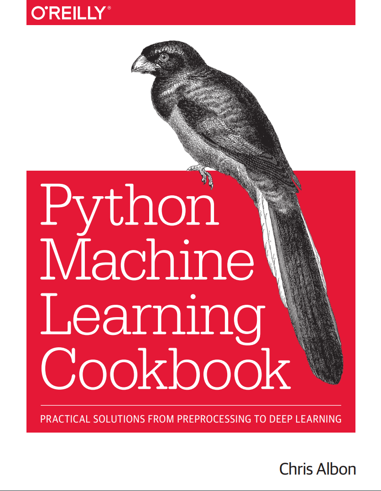

# Python Machine Learning Cookbook - Code Implementations

<p align="center">
  
</p>

This repository contains my personal code implementations for the **"Python Machine Learning Cookbook: Practical Solutions from Preprocessing to Deep Learning"** by **Chris Albon**.

This collection of Jupyter Notebooks serves as a hands-on guide, following the book's 21 chapters. Each notebook contains the practical code "recipes" for tackling common machine learning challenges.

---

## 📚 Chapter Implementations

Each notebook file (`.ipynb`) corresponds to a chapter from the book.

* **Chapter 01:** [Vectors,Matrices and Arrays](chap01.ipynb) 
* **Chapter 02:** [Loading Data](chap02.ipynb) 
* **Chapter 03:** [Data Wrangling](chap03.ipynb) 
* **Chapter 04:** [Handling Numerical Data](chap04.ipynb) 
* **Chapter 05:** [Handling Categorical Data](chap05.ipynb) 
* **Chapter 06:** [Handling Text](chap06.ipynb) 
* **Chapter 07:** [Handling Date and Time](chap07.ipynb) 
* **Chapter 08:** [Handling Images](chap08.ipynb)
* **Chapter 09:** [Dimensionality Reduction using Feature Extraction](chap09.ipynb) 
* **Chapter 10:** [Dimensionality Reduction using Feature Selection](chap10.ipynb) 
* **Chapter 11:** [Model Evaluation](chap11.ipynb)
* **Chapter 12:** [Model Selection](chap12.ipynb) 
* **Chapter 13:** [Linear Regression](chap13.ipynb)
* **Chapter 14:** [Trees and Forests](chap14.ipynb)
* **Chapter 15:** [K-Nearest Neighbours](chap15.ipynb)
* **Chapter 16:** [Logistic Regression](chap16.ipynb)
* **Chapter 17:** [Support Vector Machines](chap17.ipynb) 
* **Chapter 18:** [Naive Bayes](chap18.ipynb) 
* **Chapter 19:** [Clustering](chap19.ipynb) 
* **Chapter 20:** [Neural Networks](chap20.ipynb) 
* **Chapter 21:** [Model Saving & Loading](chap21.ipynb) - 


---

## 🚀 How to Use This Repository

To run these notebooks on your local machine, follow these steps:

1.  **Clone the repository:**
    ```bash
    git clone [https://github.com/us-utkarshrsh07/ml-cookbook.git](https://github.com/us-utkarshrsh07/ml-cookbook.git)
    cd ml-cookbook
    ```

2.  **Create a virtual environment (Recommended):**
    ```bash
    python -m venv venv
    source venv/bin/activate  # On Windows: venv\Scripts\activate
    ```

3.  **Install dependencies:**
    You'll need the standard data science stack.
    ```bash
    pip install jupyter pandas numpy scikit-learn matplotlib seaborn tensorflow
    ```
    *(Tip: You can create a `requirements.txt` file with these libraries to make installation easier for others!)*

4.  **Start Jupyter Notebook or Jupyter Lab:**
    ```bash
    jupyter lab
    ```
    or
    ```bash
    jupyter notebook
    ```

5.  Open any `chapXX.ipynb` file to explore the code.

---

## 📂 Other Files

* **[Social_Network_Ads.csv](Social_Network_Ads.csv):** A sample dataset used in one of the chapter notebooks.
* **[best_model.h5](best_model.h5):** A trained model file (HDF5 format) saved from one of the deep learning chapters.

---

## 📖 About the Book

* **Title:** Python Machine Learning Cookbook
* **Author:** Chris Albon
* **Publisher:** O'Reilly Media

This book is an excellent resource for any data scientist or ML engineer. I highly recommend purchasing it for a complete understanding of the concepts behind this code.
